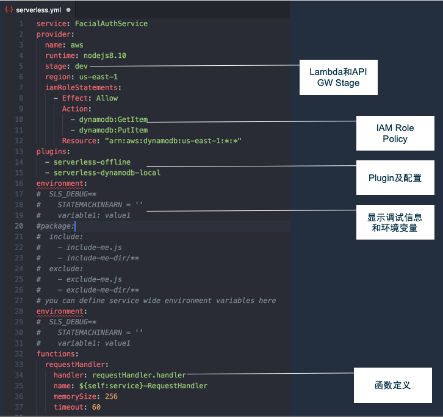

# Re-architecture: 将传统的Web应用转型为Serverless架构 #

1. 关于Serverless Web Application，以及应用场景

Serverless架构的应用场景有很多，特别适合于由事件触发类型的应用，如下图所示，本文主要集中在使用Serverless架构来实现Web应用，并且是带有服务端逻辑的应用。

如果我们对Serverless Web Application所适用的场景进一步总结，有以下特点：

- 有很多自开发，自维护的Web Application

- 面向业务用户，合作伙伴，有一定的SLA要求

- 通常访问并发量不高，有大量的空闲时间，无弹性

- 基于Java, .NET, PHP, Node.JS等语言和框架开发

- 操作系统、运行时、框架需要自维护（补丁、备份、升级等）

Serverless化后可以带来的好处：

- 开发技术，流程无需太多改变

- 调用或响应时付费
- 开发和运维团队无需考虑操作系统、运行时部署
- 减少运维和安全合规的工作量
- 面向Cloud编程，更容易向微服务化进行演进

我们再来看看哪些类型的Web应用架构可以开发/转换为Serverless架构？

- 最佳：前后端分离架构最优，后端服务开发语言需要得到的Lambda支持 

  主流框架：Node.JS Express, Python Flask, Java Spring Boot, .NET Core WebAPI ……

- 一般：MVC架构（带有后端页面模板和引擎） 

   API Gateway可从服务器端输出页面，需要将静态资源分离，放在S3当中。

- 关于.NET平台

  支持：  ASP.NET Core

  不支持：ASP.NET WebForm, ASP.NET MVC

  

2. 使用的系统架构与相关服务

整体Serverless Web应用的核心将由API Gateway来接收请求并发送响应，所有的业务逻辑，包括对数据的访问，全部由Lambda函数来完成。也就是将原有系统中的业务逻辑层，数据访问层，都封装在Lambda函数当中供调用。静态资源，如HTML, CSS, Javascript等，放在S3当中，以Web Site形式进行发布即可。

更进一步，还可以配合Cloudfront来实现全球的访问加速，使用Step Function来对Lambda函数的调用逻辑进行编排，利用IAM可以控制API Gateway可调用的Lambda函数，或Lambda能够访问的资源权限，利用X-ray可以对整体调用链进行跟踪和遥测。

如下图所示：

按照分层的视角和流程来看Serverless Web应用的架构：

这里将会引出一个老生常谈的问题：单体Lambda还是多个Lambda，这个问题等于“单体应用还是微服务”。这里也简单总结了一些对比：

|       | **单体Lambda**                                               | **多个Lambda——类似微服务架构**                               |
| ----- | ------------------------------------------------------------ | ------------------------------------------------------------ |
| Pros: | 适合迁移，较少的修改工作量 非分布式，部署、调试“可能会较快” | 适合新开发项目 更适合团队并行开发与协作 个体功能更容易更新 |
| Cons: | Handle所有的请求GET/PUT/POST… 需有实现路由机制 更新影响全局 | “分布式”架构更复杂 调试难度、工作量加大 Lambda之间没有RPC调用，需要通过HTTP |

3. 开发Serverless Web应用的框架支持

在实际的项目开发时，建议大家选择一个框架来开发或转换Serverless Web应用，它能带来的好处有：项目脚手架，资源管理，命令行工具，快速部署，本地模拟调试等等。这些是完全手工编写所不具备的优势。目前在Serverless领域比较知名的框架：

	- Serverless
	- Claudia.js
	- Chalice
	- Sparta
	- APEX
	- Zappa

这里较推荐大家使用(Serverless framework)[http://serverless.com]，接下来的工作我们也是以这个框架为例，它的功能与特点：

- 支持模板和语言众多

   Node.JS, TypeScript, Python, Java, C#, Kotlin, Go, Scala…

- 支持CLI命令行

  创建新项目：serverless(sls) create --template aws-nodejs --path my-new-service

  部署: sls deploy, 本地调用: sls local invoke

- Plugin丰富, 常用插件推荐：

  serverless-offline: 在本地运行API Gateway并调用函数，方便调试

  serverless-dynamodb-local: 在本地模拟DynamoDB，可生成Get, Put等代码

  serverless-apigw-binary: 开启API Gateway返回二进制response

  serverless-appsync-plugin: 部署AppSync GraphQL API

  serverless-plugin-aws-alerts: 添加CloudWatch Alarms

  serverless-warmup: 预热

  More: https://github.com/serverless/plugins

  

  若要使用Serverless 框架，第一步需要创建项目并配置配置文件：serverless.yml， 重要的配置项：

  Profile: 可指定aws CLI profile，方便在不同的环境中切换

  Package.json文件：

  Serverless默认不打包devDependencies中的库，如果发布之后发现有缺少相关库的错误，需要查看是否放在了dev中。

  可以选择将awssdk放在devDependencies，以减少包的size

  详细配置示例与关键说明：

  

  

  4. 动手将本实例中的Web应用迁移为Serverless架构

     1). 原应用系统技术架构

     ​	- 前后端分离架构开发

     ​	- 后端技术：

     ​		• Node.js + Express

     ​	- 前端技术：

     ​		•Vue

     ​		•构建工具

     ​			Webpack

     2). 将本示例中的应用迁移成Serverless Web应用的步骤：

     ​	- 安装serverless framework: npm install -g serverless

     ​	- 在项目源代码目录运行npm install serverless-http

     ​	- 修改app.js (或其他入口文件)

     ​	 	添加const serverless = require('serverless-http’);

     ​	 	module.exports = app; -> module.exports.handler = serverless(app);

     ​	-  加serverless.yml

     ​	-  sls deploy进行部署，会将serverless.yml中定义的API Gateway, Lambda函数，IAM权限等全部部署至AWS, API Gateway示例：

     

     ​	-  部署前端资源到S3

     ​	-  测试

     3). 解决跨域请求问题

     该问题的来源：由于后端通过API Gateway发布，前端托管在S3 Web site之上，导致前后端会有不同的域名。因此必须要将此问题解决。

     本文是基于本示例代码中所使用的开发框架和技术(Node.JS, Express, VUE)进行实现，如采用其他开发框架，思路类似。

     对于在开发调试的过程中，可使用VUE proxy table来解决。**//仅用于开发调试使用，对生产环境无效**

     正式生产环境，需要使用CORS来解决，具体步骤：

     - API Gateway添加配置

       Access-Control-Allow-Credentials=‘true’

       Access-Control-Allow-Origin不等于'*'

       Methods: Enable OPTIONS

     - 前端请求

       axios.defaults.withCredentials=true;

     - 后端Express框架中

       app.use(cors({credentials: true, origin: ‘<*|Domain>’}));

     项目截图示例

     服务器端项目：

     

     客户器端项目：

     

  4). 关于配置信息

  通常开发一个应用会使用配置文件来进行某些关键性配置，如：数据库连接字符串等。对迁移至Serverless架构之后，配置信息的处理建议：

  •通过传统配置文件形式（**不推荐**），修改配置需要修改Lambda函数，仅在已有架构下使用

  • 使用Lambda环境变量，在代码中使用process.env, or os.environ获取

  • 使用DynamoDB存储

  5). 其他关于Lambda函数的建议

  •为每个Lambda函数配置DLQ，发送到SQS或SNS

  •保证代码逻辑的幂等性

  •复杂Lambda相互调用可使用Step Function

  •使用X-ray

  6) . Lambda运行配置选型注意

  由于Lambda的运行所使用的CPU，网络配置是由内存所决定的，因此会产生一个有趣的现象：**小内存不一定价格便宜**，下图比较了Lambda函数在不同内存配置下的运行时间和费用情况：

  | 128mb  | 11.722965sec | $0.024628 |
  | ---------- | ------------ | --------- |
  | 256mb  | 6.678945sec  | $0.028035 |
  | 512mb  | 3.194954sec  | $0.026830 |
  | 1024mb | 1.465984sec  | $0.024638 |

  那么在实际项目中又该如何评估呢？

  可以使用serverless plugin: aws-lambda-power-tuning 进行不同配置下的测试，以得到一个效率和费用的最佳选择。

